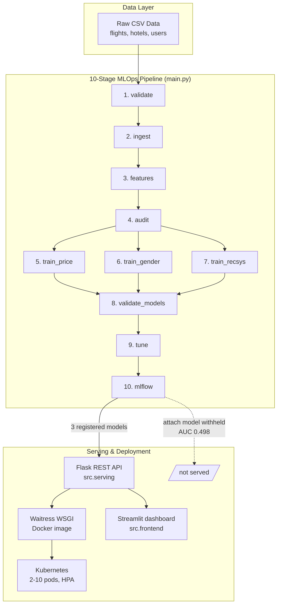

# Voyage Analytics — Integrating MLOps in Travel


## System Architecture



The dashed branch is deliberate: the hotel-attach model is trained and logged, but measured at
chance, so it is neither registered nor served.

## Tech Stack

- **Core & pipeline**: Python 3.12, pandas, NumPy, SciPy
- **Machine learning**: scikit-learn — HistGradientBoosting, Ridge, LogisticRegression, item-item CF
- **MLOps & tracking**: MLflow (experiment tracking + model registry)
- **API & serving**: Flask, Waitress (WSGI)
- **Dashboard**: Streamlit + Plotly
- **Containerisation**: Docker (multi-stage), Docker Compose
- **Orchestration**: Kubernetes (Deployment, Service, HPA, PDB)
- **CI/CD**: GitHub Actions — ruff, pytest, image build, manifest checks
- **Quality assurance**: 17 pytest tests, schema/invariant auditing, cross-validation with
  confidence intervals and permutation testing

## Quick start

```bash
# Clone the repository
git clone https://github.com/Arnab-Ghosh7/Voyage_Analytics.git
cd Voyage_Analytics

# 1. activate the environment
.venv/Scripts/Activate.ps1          # Windows PowerShell (or source .venv/bin/activate on Linux/macOS)

# 2. run the whole pipeline
python main.py
```

## Pipeline

`main.py` runs every stage in `src/` sequentially, in dependency order:

| # | Stage | Does | Writes |
|---|---|---|---|
| 1 | `validate` | Gate the raw CSVs on schema, bounds and referential rules | `reports/` |
| 2 | `ingest` | Clean the raw CSVs; build the entity tables | `data/interim/`, `data/processed/` |
| 3 | `features` | Build model-ready feature sets | `data/processed/` |
| 4 | `audit` | Re-validate every table the pipeline wrote | `reports/` |
| 5 | `train_price` | Flight-price regression (objective #1) | `models/`, `reports/` |
| 6 | `train_gender` | Gender classification (objective #8) | `models/`, `reports/` |
| 7 | `train_recsys` | Hotel recommender + attach model (objective #9) | `models/`, `reports/` |
| 8 | `validate_models` | Cross-validate all models with confidence intervals | `reports/` |
| 9 | `tune` | Hyperparameter search vs the untuned baseline | `models/tuned/`, `reports/` |
| 10 | `mlflow` | Track runs, register validated models (objective #7) | `mlflow/mlruns/` |

```bash
python main.py                          # everything
python main.py --quick                  # fast smoke run (40k-row training sample)
python main.py --stages ingest features # a subset, in the order given
python main.py --skip validate audit    # everything except those stages
python main.py --parquet                # parquet instead of CSV
python main.py --list                   # show stages and exit
```

Exit code is `0` only if every requested stage succeeded. A failing stage stops the
run — later stages depend on earlier artifacts, so continuing would only produce
misleading results.

## Prediction API

```bash
python -m src.serving                 # http://127.0.0.1:5000
pytest tests/ -q                      # 17 API tests
```

| Endpoint | Method | Serves |
|---|---|---|
| `/predict/flight-price` | POST | fare in R$ (R² 0.936) |
| `/predict/gender` | POST | male/female from first name (acc 0.884) |
| `/recommend/hotels` | POST | hotel suggestions (hit@3 0.858) |
| `/health` · `/reference` · `/` | GET | probes and valid input values |

```bash
curl -X POST http://127.0.0.1:5000/predict/flight-price \
  -H "Content-Type: application/json" \
  -d '{"from":"Sao Paulo (SP)","to":"Rio de Janeiro (RJ)","flightType":"firstClass","agency":"Rainbow"}'
```

#### Payload & response examples

These are **actual** responses from the running service, not illustrations. Every response carries the
model's measured quality and its caveats alongside the prediction, so a number cannot be consumed
without its context.

##### 1. Flight price (`POST /predict/flight-price`)
**Request** — four business fields; `distance` is derived, not supplied:
```json
{
  "from": "Sao Paulo (SP)",
  "to": "Rio de Janeiro (RJ)",
  "flightType": "firstClass",
  "agency": "Rainbow"
}
```
**Response:**
```json
{
  "predicted_price": 1022.13,
  "currency": "BRL",
  "derived": { "distance_km": 331.89 },
  "inputs": {
    "from": "Sao Paulo (SP)", "to": "Rio de Janeiro (RJ)",
    "flightType": "firstClass", "agency": "Rainbow", "date": "2026-08-20"
  },
  "model": {
    "name": "gbr_rate_per_km",
    "r2_unseen_routes": 0.936,
    "rmse": 88.99,
    "note": "Expect roughly +/- R$89 on a route unseen in training."
  }
}
```

##### 2. Gender classification (`POST /predict/gender`)
```json
{ "name": "Alexandre Silva" }
```
**Response:**
```json
{
  "predicted_gender": "male",
  "confidence": 0.6672,
  "inputs": { "name": "Alexandre Silva", "first_name_used": "alexandre" },
  "model": {
    "name": "name_logistic",
    "accuracy": 0.884,
    "accuracy_unseen_names": 0.743,
    "caveat": "Infers gender from the given name, not from travel behaviour. Behaviour-only models measured at chance. Reflects the naming conventions of the training data."
  }
}
```

##### 3. Hotel recommendations (`POST /recommend/hotels`)
Takes a **destination**, not a user id — the ranking is contextual:
```json
{ "destination": "Rio de Janeiro (RJ)", "top_k": 3 }
```
**Response:**
```json
{
  "recommendations": [
    { "rank": 1, "hotel": "Hotel CB", "city": "Rio de Janeiro (RJ)", "nightly_rate": 165.99 },
    { "rank": 2, "hotel": "Hotel K",  "city": "Salvador (BH)",       "nightly_rate": 263.41 },
    { "rank": 3, "hotel": "Hotel BD", "city": "Natal (RN)",          "nightly_rate": 242.88 }
  ],
  "strategy": "destination-aware",
  "inputs": { "destination": "Rio de Janeiro (RJ)", "top_k": 3 },
  "note": "Each city has exactly one hotel, so when a destination is supplied the match is exact and no model is needed. Ranking matters only when the destination is unknown."
}
```

> The hotels in this dataset are anonymised (`Hotel A`, `Hotel CB`, `Hotel K` …), one per city — not
> real hotel brands. `GET /reference` returns the valid cities, classes, agencies and hotels.

Callers send **business inputs, not model features** — `distance` is derived from the route (it is
fixed per city pair) rather than demanded, keeping the train/serve contract in one place. Models are
**warmed at startup**: without that the first request paid an 8.5 s model load. After warmup, p95
latency is 21 ms / 10 ms / 1 ms against the PRD's 500 ms budget. The hotel-attach model is
deliberately **not exposed** — at AUC 0.498 an endpoint would make a coin flip look authoritative.

For production use a WSGI server, not Flask's dev server:

```bash
waitress-serve --port=5000 src.serving.app:app
```

## Dashboard (Streamlit)

```bash
streamlit run src/frontend/app.py     # http://localhost:8501
python -m src.frontend                # same thing
```

Seven pages, navigated by pills across the top: **Home** (hero + capability cards), **Flight price**,
**Gender**, **Hotels** (interactive predictions), **Data insights** (EDA charts), **Dashboard** (KPI
cards + pipeline status), **Performance** (metrics, including the model that failed).

A selector switches the prediction source between **in-process model loading** and **calling the Flask
API**. Keeping both means the dashboard works when the API is down, and switching modes proves the two
paths agree — so it doubles as a smoke test for the deployment.

Styling lives in `src/frontend/theme.py` (design tokens, injected CSS, card/panel components) so the
page functions stay readable.

The UI states each model's caveats **next to** its predictions rather than burying them: the gender
page warns that it infers from the *given name* and is unreliable outside Brazilian naming
conventions, and the Dashboard shows the failed hotel-attach model as a grey "At chance" card rather
than quietly omitting it.

## Docker

```bash
docker build -t voyage-analytics-api .
docker run -d --name voyage-api -p 5000:5000 voyage-analytics-api
curl http://localhost:5000/health

docker compose up --build -d                  # API only
docker compose --profile tracking up -d       # + MLflow UI on :5001
```

Multi-stage build: compilers live in the builder stage and never reach the runtime image. Only the
**serving** dependencies are installed (7 packages, not the project's 20) — `scikit-learn`, `numpy`
and `scipy` pinned to the exact versions the models were *fitted* with, since a joblib artifact
carries no version metadata and a mismatch fails confusingly. Runs as a non-root user with a
read-only filesystem, and the health check allows a **40-second start period** because the cold model
load measures ~9 s.

Note `models/` is in `.gitignore` but deliberately **not** in `.dockerignore` — the fitted pipelines
are the point of the image. Retraining means rebuilding, which makes the image tag the version of
record for both code and weights.

## Kubernetes

```bash
docker build -t voyage-analytics-api .    # image must exist locally first
kubectl apply -f k8s/
kubectl get pods -w                       # wait for 2/2 Running
curl http://localhost:30500/health
```

| Manifest | Contains |
|---|---|
| `k8s/deployment.yaml` | Deployment — 2 replicas, probes, resource limits, hardening |
| `k8s/service.yaml` | NodePort Service (`:30500`) + ConfigMap |
| `k8s/hpa.yaml` | HorizontalPodAutoscaler (2→10) + PodDisruptionBudget |

**The probe configuration is driven by a measurement, not a default.** Loading the
gradient-boosting pipeline cold takes **9–16 seconds**. A stock readiness probe would mark the pod
unready and restart-loop it forever, so a **`startupProbe` absorbs the slow boot** (20 × 5 s = 100 s
budget) and only hands over to the liveness/readiness pair once the models are warm. CI asserts that
budget stays ≥ 60 s so nobody tightens it without understanding why it's there.

The same cold-start drives the autoscaler: **scale up fast** (30 s window, allow doubling) because a
new pod needs a quarter-minute before it can serve, and **scale down slowly** (300 s window, one pod
at a time) to avoid paying that cost again on the next traffic bump.

Hardening: non-root (uid 1000), read-only root filesystem with a `tmpfs` for `/tmp`, all capabilities
dropped, `maxUnavailable: 0` so a rolling update never dips below capacity.

## CI/CD

`.github/workflows/ci.yml` runs on every push and PR to `main`:

| Job | Does |
|---|---|
| **lint** | `ruff` — blocking on crash-level rules (E9/F63/F7/F82), style reported non-blocking |
| **test** | Imports every module → validation gate → ingest → features → audit → train (sampled) → `pytest` |
| **docker** | Builds the serving image with layer caching, then smoke-tests that the container boots and serves HTTP |
| **manifests** | Validates the Kubernetes YAML and asserts the startup-probe budget and security settings |

The test job trains with `--quick` on a **sample**, deliberately: CI should prove the pipeline is
wired correctly, not spend 20 minutes reproducing metrics that are already recorded in `reports/`.

## Running stages individually

Every stage is also a standalone module:

```bash
python -m src.validation                    # raw gate
python -m src.validation --scope processed  # audit generated tables
python -m src.data_ingestion
python -m src.features
python -m src.models.flight_price
python -m src.models.gender
python -m src.models.recommender
python -m src.models.evaluation             # cross-validation
python -m src.models.tuning                 # hyperparameter search
python -m src.mlops                         # MLflow tracking + registry
```

### Two kinds of validation — don't confuse them

| | **Data** validation | **Model** validation |
|---|---|---|
| Module | `src/validation/` | `src/models/evaluation.py` |
| Notebook | `05_Data_Validation` | `07_Model_Validation` |
| Stages | `validate` (raw gate), `audit` (processed) | `validate_models` |
| Question | *Is the data trustworthy?* | *Are the scores trustworthy?* |
| Method | schema · bounds · referential · business invariants | cross-validation · confidence intervals · permutation test |
| Report | `reports/data_quality_report.json` | `reports/model_validation.json` |

**Data validation** is deliberately separate from ingestion so it can run *before* cleaning (gating
raw input) and *again after* the feature stage (auditing what was written). Schema, bounds and
referential violations are **errors** that stop the run; nulls, duplicates and unseen categories are
**warnings**.

**Model validation** replaces single-split scores with cross-validated ranges, and formally tests the
two "at chance" verdicts (permutation test for gender, AUC confidence interval for hotel attach).

## Layout

```
voyage-analytics/
├── main.py                 # pipeline entry point
├── data/
│   ├── raw/                # source CSVs (flights, hotels, users)
│   ├── interim/            # cleaned, typed tables
│   └── processed/          # entity + model-ready feature tables
├── notebooks/              # 01 EDA · 02 ingestion · 03 flight price · 04 features
│                           # 05 data validation · 06 mlflow · 07 model validation
│                           # 08 tuning · 09 Flask API · 10 Docker
├── .streamlit/             # dashboard theme config
├── src/
│   ├── validation/         # raw gate + processed audit (own pipeline stage)
│   ├── data_ingestion/     # clean · build entity tables · typed readers
│   ├── features/           # feature registry · shared encoder · feature builders
│   ├── models/             # flight_price · gender · recommender · evaluation
│   ├── mlops/              # MLflow tracking + model registry
│   ├── serving/            # Flask prediction API
│   ├── frontend/           # Streamlit dashboard
│   └── utils/              # config (paths, schema, dtypes) · logger
├── models/                 # trained artifacts (.joblib)
├── reports/                # metrics JSON + figures/
├── k8s/                    # Deployment · Service · HPA · PDB
├── .github/workflows/      # CI: lint · test · docker · manifests
├── pipelines/              # (next) Airflow DAGs
├── tests/                  # pytest suite (17 API tests)
└── requirements.txt
```

## Data

Three linked sources covering Brazilian corporate travel, 2019-09 → 2023-07:

| File | Rows | Grain |
|---|---|---|
| `flights.csv` | 271,888 | one flight leg (2 legs = 1 round trip) |
| `hotels.csv` | 40,552 | one hotel stay |
| `users.csv` | 1,340 | one traveller |

All three are clean — no missing values, no duplicates.

**Note on formats:** interim/processed tables are written as **CSV**. Because CSV
does not preserve dtypes, always load them through the typed readers rather than a
bare `pd.read_csv`:

```python
from src.data_ingestion import load_interim, load_processed
flights = load_interim("flights_clean")       # dates & categoricals restored
price   = load_processed("flight_price_model")
```

## Key findings from EDA

These are the data properties that shaped every modelling decision below.

- **Flight price is a deterministic rate card** — `(from, to, flightType, agency)` fixes the fare
  exactly. A random train/test split therefore scores R² ≈ 1.0 by *memorising* it, so models are
  selected on a **held-out-routes** split instead. On that split the ranking inverts: plain gradient
  boosting drops to 0.699 because it cannot extrapolate to unseen city pairs.
- **`time` duplicates `distance`** (r = 0.99999) — dropped for collinearity.
- **Every trip is a perfect round trip** — two legs, and all outbound legs depart on a Thursday. A
  synthetic-calendar artefact, which is why the date features carry no signal.
- **Demographics don't predict value**; behaviour does. Age, gender and company all correlate ~0 with
  spend and frequency.
- **Travel behaviour carries no gender signal** — strongest |r| = 0.06, classes balanced ~50/50. The
  working classifier reads the **first name** instead (see results below).
- **The user × hotel matrix is dense (82.5%), not sparse** — one hotel per city means the destination
  determines the choice.
- **Hotel attach is a flat ~30%** across every destination, class, agency and year — no segment to
  target, which is why that model measures at chance.

## Model results (cross-validated, 95% CI)

| Model | Type | Score | vs chance | Verdict |
|---|---|---|---|---|
| Flight price (`gbr_rate_per_km`) | Regression | R² **0.936** [0.913, 0.960] | — | ✅ valid |
| Gender (`name_logistic`) | Classification | acc **0.884** [0.874, 0.894] | 0.500, p = 0.0099 | ✅ valid |
| Hotel ranking (item-CF) | Collaborative filtering | hit@3 **0.858** [0.840, 0.878] | 0.333 | ✅ valid |
| Hotel attach (HistGBM) | Classification | AUC **0.498** [0.495, 0.501] | 0.500 | ❌ at chance |

**Flight price — predict the rate, not the fare.** Price is essentially *rate-per-km × distance*.
Training on the raw fare forces the model to re-learn that scaling for every route, which is exactly
what fails on an unseen city pair. Dividing the target by distance (`RatePerKmRegressor`) cut MSE on
held-out routes from **15,431 to 7,919 (−49%)** and lifted R² from 0.875 to 0.936.

**Gender — the signal is in the name, not the behaviour.** Every travel feature correlates with
gender at |r| ≤ 0.06, and behaviour-only models sit at chance. First-name character n-grams reach
**0.884** (p = 0.0099). Held out *by name*, so the test set contains only names never seen in
training, accuracy is **0.743** — still far above chance, and the honest figure for a novel name.
Worth stating plainly: this model infers gender from a given name, which is a different claim from
inferring it from travel behaviour, and it inherits the naming conventions of its training data.

**Hotel attach is genuinely unpredictable.** AUC 0.498 with a tight interval on 135,944 trips is a
confident measurement of no signal, not uncertainty. Adding the user's prior attach history moved it
to 0.4989 (correlation −0.0019). It is **logged in MLflow but not registered** — a registered model
reads as approved-to-serve.

### Hyperparameter tuning

`GridSearchCV` / `RandomizedSearchCV` over all models (`src/models/tuning.py`). Gains: flight price
**+0.0026**, gender **+0.0148**, attach **+0.0043** — only gender's clears the 0.01 threshold, so the
defaults were already close to optimal elsewhere.

Two methodological points that each caught a real error:

1. **Like-for-like baseline.** The comparison scores the *default* estimator under the identical CV,
   sample and scorer as the search. Comparing against `model_validation.json` (different folds, full
   data) reports a phantom gain or regression.
2. **Selection bias.** `GridSearchCV.best_score_` is the maximum over N candidates on the folds it
   searched, so it is optimistically biased. The gender search reported 0.5333 — contradicting the
   permutation test — but re-scored on fresh folds it was 0.4885, i.e. chance. Winners are now
   re-verified on unseen folds and that figure is what gets reported.

## Status

- [x] EDA (`notebooks/01`)
- [x] Data validation stage (`src/validation`)
- [x] Data ingestion (`src/data_ingestion`)
- [x] Feature engineering + registry (`src/features`)
- [x] Flight-price regression (`src/models/flight_price.py`)
- [x] Gender classification (`src/models/gender.py`)
- [x] Hotel recommender + attach (`src/models/recommender.py`)
- [x] Model validation / cross-validation (`src/models/evaluation.py`)
- [x] MLflow tracking & model registry (`src/mlops`)
- [x] Hyperparameter tuning (`src/models/tuning.py`)
- [x] Flask prediction API (`src/serving`) + tests (`tests/test_serving.py`)
- [x] Docker image + Compose stack (`Dockerfile`, `docker-compose.yml`)
- [x] Streamlit dashboard (`src/frontend`)
- [x] Kubernetes manifests + autoscaling (`k8s/`)
- [x] CI/CD pipeline (`.github/workflows/ci.yml`)
- [ ] Airflow orchestration — the one remaining project objective
